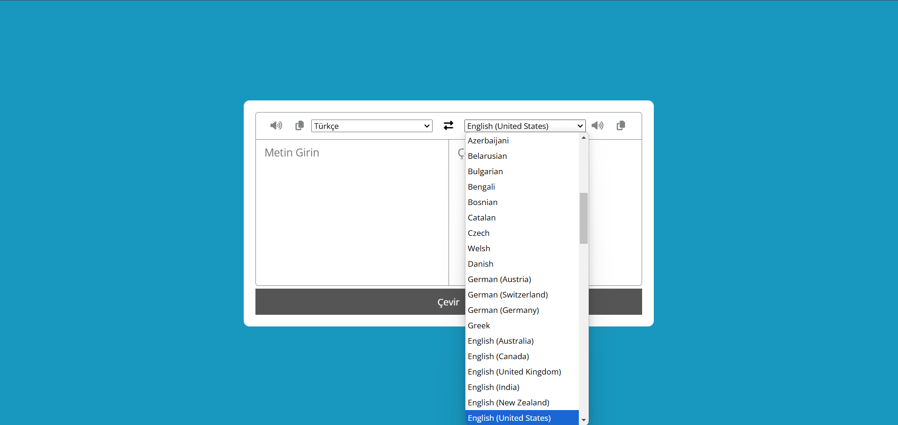

# 🌍 Çeviri Uygulaması

Kullanıcıların farklı diller arasında metin çevirisi yapmasını sağlayan basit ve kullanışlı bir çeviri uygulaması.

## 📌 Proje Konusu

Bu proje, kullanıcıların **girdiği metni** belirlenen diller arasında çevirmesini sağlar. Kullanıcılar, dil seçimi yaparak anında çeviri alabilir, metni kopyalayabilir ve sesli olarak dinleyebilir.

## 🎯 Neden Geliştirildi?

Bu projeyi geliştirme motivasyonum:  
✅ **API kullanımı** ve dış veri kaynaklarından veri çekme konusunda deneyim kazanmak  
✅ **JavaScript ile asenkron işlemler** (fetch API) ve **Promise** yapısını kullanarak veri çekme pratiği yapmak  
✅ **Web Speech API** kullanarak metni sesli okuma özelliği eklemek  

## 🚀 Ne Öğrendim?

Bu projeyi geliştirirken aşağıdaki konularda bilgi ve deneyim kazandım:  

- **JavaScript Fetch API** ile çeviri servisini kullanma  
- **Asenkron işlemler ve Promise yapısı** ile veri çekme ve işleme  
- **DOM Manipülasyonu** ile kullanıcıdan giriş alma ve çıktıyı ekrana yazdırma  
- **Web Speech API** kullanarak metni sesli okuma  
- **Clipboard API** ile metni kopyalama işlemleri  

## 🔥 Özellikler

✅ Kullanıcıların metin girmesi ve farklı diller arasında çevirebilmesi  
✅ **Tek tıklamayla** metni kopyalama özelliği  
✅ **Sesli okuma özelliği** ile çeviri yapılan metni dinleme  
✅ **Diller arasında değişim yapabilme**   
✅ **Kullanıcı dostu** bir arayüz  

## 🔧 Kullanılan Teknolojiler

- **HTML5** - Yapıyı oluşturmak için  
- **CSS3** - Responsive ve şık tasarım için  
- **JavaScript (ES6+)** - API’den veri çekme, veri işleme ve dinamik içerik  
- **MyMemory Translation API** - Çeviri işlemleri için  
- **Web Speech API** - Metni sesli okuma özelliği  
- **Clipboard API** - Kopyalama işlemi için  

## 🖥 Ekran Görüntüleri

